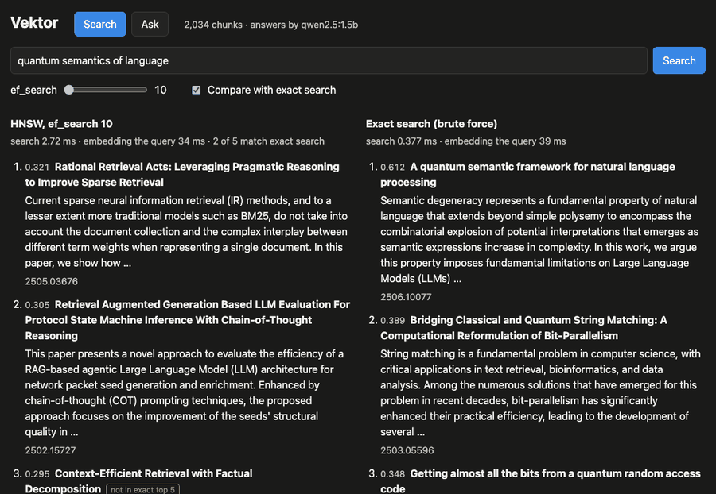
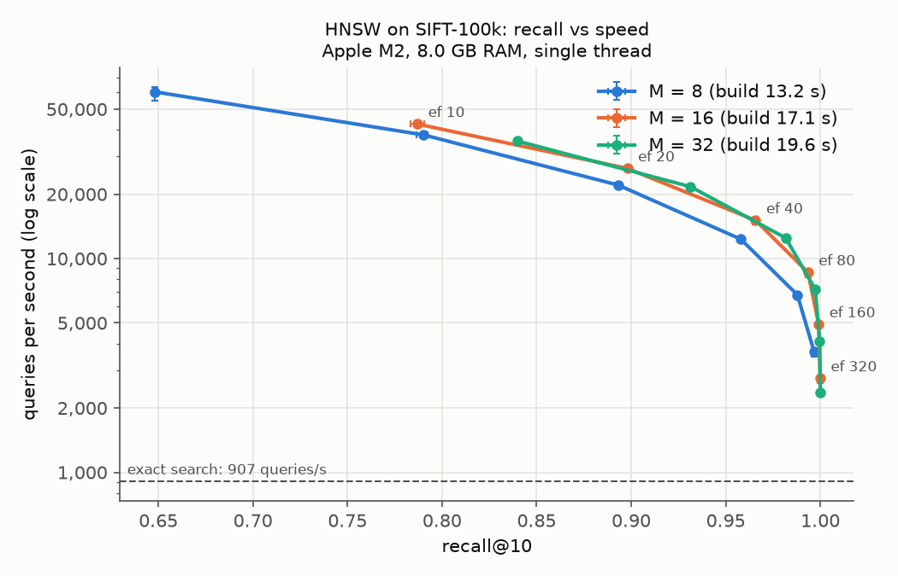
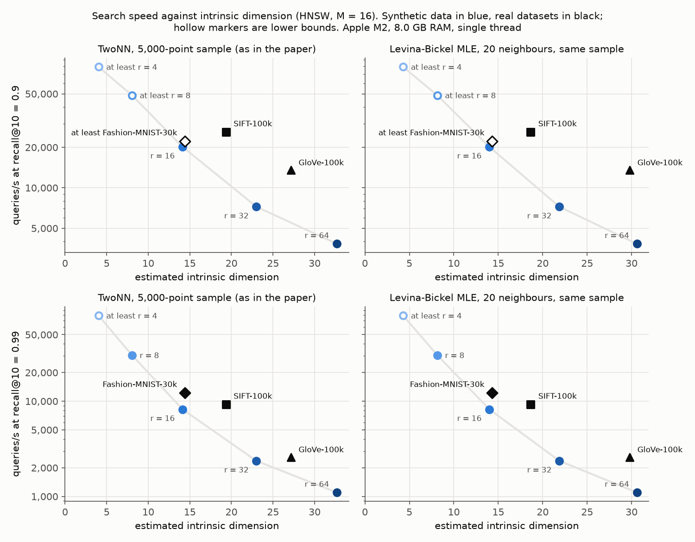
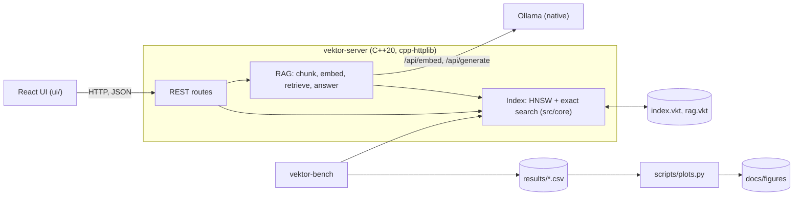
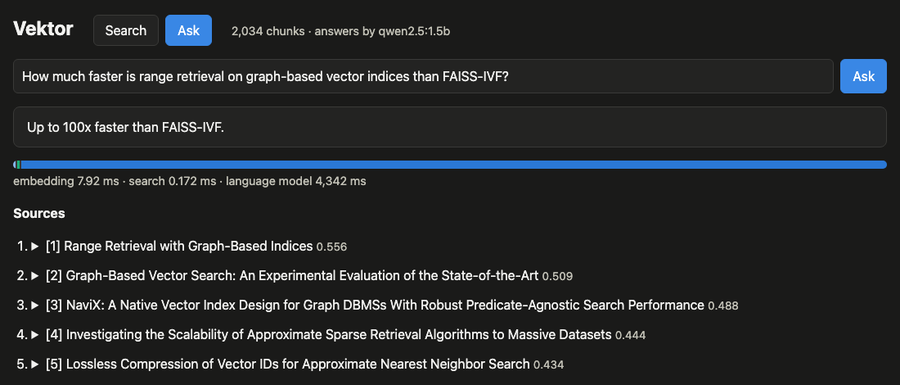

# Vektor

[](https://github.com/anibitri/vektor/actions/workflows/ci.yml)

Vektor is a small vector search engine written in C++20. It implements HNSW, the graph-based
approximate nearest neighbour algorithm, from scratch; benchmarks it on standard datasets; serves
it over a REST API; and uses it to power a small RAG (retrieval-augmented generation) app with a
React UI, running entirely on a laptop with [Ollama](https://ollama.com). It also re-tests the
intrinsic-dimension findings of my [ANN paper](https://github.com/anibitri/ANN_methods) on its own
HNSW.



*The UI searching 2,034 arXiv abstracts. As `ef_search` grows from 10 to 320, HNSW's results
(left) converge on exact search's (right); results exact search did not return are marked.*

## Results

All measured on an Apple M2 (8 GB RAM, macOS 26.6.2, Apple clang 21), one thread. Method and
discussion: [docs/benchmarks.md](docs/benchmarks.md) and
[docs/rag-evaluation.md](docs/rag-evaluation.md).

- **Speed.** On SIFT-100k (100,000 vectors, 128 dimensions), HNSW with `M = 16` finds **96.6% of
  the true 10 nearest neighbours at 15,086 queries per second, 16.6× faster than exact search**
  (907 queries/s; mean of 3 runs). The index takes 697 bytes per vector: 512 for the vector and
  185 for the graph.
- **Research.** The intrinsic-dimension findings of my paper reproduce: measured the paper's
  way, Vektor estimates SIFT's intrinsic dimension at 19.3 (paper: 19.4); with 128 coordinates
  fixed, speed at recall 0.95 drops about tenfold from intrinsic dimension 8 to 32 (paper: about
  tenfold from 5 to 30); and the number of coordinates does not predict difficulty (Fashion-MNIST,
  784 coordinates but an intrinsic dimension of about 14, is the fastest real dataset at recall
  0.95 and 0.99).
- **RAG.** On 40 labelled questions over 2,031 arXiv abstracts, retrieval puts the answering
  abstract first for 92.5% of questions and in the top 5 for all of them; HNSW matches exact
  search from `ef_search = 20`. When answering, the language model takes 99% of the time and the
  vector search about 0.02%.





## Quickstart

```bash
make build test                  # build and run the tests
make datasets bench plots        # download the datasets, run every benchmark (about 25 minutes)

brew install ollama              # or see ollama.com
ollama serve                     # in its own terminal
ollama pull all-minilm && ollama pull qwen2.5:1.5b
make up SERVER_ARGS="--llm-model qwen2.5:1.5b"   # server and UI on http://localhost:8080
make rag-ingest rag-eval         # in another terminal: load the arXiv corpus and evaluate
```

## Architecture



The core library (`src/core`) has no networking, so the algorithm is tested and benchmarked on
its own. `vektor-bench` converts datasets, runs benchmarks, estimates intrinsic dimension and
evaluates the RAG app; `vektor-server` serves the API and the UI.

## Build and test

You need CMake 3.20 or newer and a C++20 compiler. CMake downloads the three C++ libraries
(GoogleTest, nlohmann/json and cpp-httplib, each pinned by version and checksum), so there is
nothing else to install. The UI needs Node.js 24.

```bash
make build       # Release build, tuned for this CPU (-march=native)
make test        # run the tests
make test-asan   # run the tests under AddressSanitizer + UndefinedBehaviorSanitizer
make test-tsan   # run the tests under ThreadSanitizer
make datasets    # download and convert the benchmark datasets (see below)
make bench       # run all benchmarks and write results/*.csv (about 25 minutes)
make plots       # draw the charts in docs/figures/ (sets up a Python venv in .venv/)
make ui          # build the web UI into ui/dist
make rag-ingest  # fetch the arXiv corpus and ingest it into a running server
make rag-eval    # evaluate retrieval and answers through a running server
make up          # build the Docker image (server and UI) and run it on http://localhost:8080
make format      # format the code with clang-format
make lint        # check the code with clang-tidy
make clean       # delete build files, datasets, index files, the venv and the UI's packages
```

CI runs on every push: formatting, clang-tidy, Release builds with GCC 14 and Clang 21, Debug
builds under AddressSanitizer + UndefinedBehaviorSanitizer and under ThreadSanitizer, the UI's
audit, lint, tests and build, and a Docker build that checks the image size and that the server
starts.

## Datasets

`make datasets` downloads each dataset, converts it to a `.vkd` file in `data/`, and then deletes
the download. `data/` is git-ignored.

| Dataset | Source | Base vectors | Queries | Dim | Metric | `.vkd` size |
| --- | --- | --- | --- | --- | --- | --- |
| SIFT-100k | [TEXMEX SIFT1M](http://corpus-texmex.irisa.fr/) | random 100,000 of 1,000,000 | random 1,000 of 10,000 | 128 | L2 | 52.1 MB |
| GloVe-100k | [glove-wiki-gigaword-100](https://github.com/RaRe-Technologies/gensim-data) (word vectors) | random 100,000 of 400,000 | 1,000 other words | 100 | cosine | 40.8 MB |
| Fashion-MNIST-30k | [Fashion-MNIST](https://github.com/zalandoresearch/fashion-mnist) (28 × 28 images) | random 30,000 training images | random 1,000 test images | 784 | L2 | 97.6 MB |
| synthetic-r | generated in memory, seed 1 (not stored) | 100,000 | 1,000 | 128 | L2 | none |

Every sample is random, with seed 42: SIFT1M stores similar vectors next to each other, so its
first rows are not a fair sample (see [docs/benchmarks.md](docs/benchmarks.md#lessons-on-measuring-intrinsic-dimension)).
Every download is checked against a pinned SHA-256 hash. The three files take 191 MB; the
downloads are deleted after conversion (peak disk use is about 700 MB, while SIFT is unpacked).

**Synthetic data** has a chosen intrinsic dimension r (4, 8, 16, 32 or 64): points from an
r-dimensional normal distribution, mapped into 128 dimensions by one fixed random matrix, plus a
little noise. Everything except r stays the same, which isolates the effect of intrinsic
dimension. It is generated each run from a seed, so it takes no disk space.

A `.vkd` file holds the base vectors, the query vectors, and the true 100 nearest neighbours of
each query. These are found once by brute force when the file is made, so benchmarks never have
to recompute them. The layout, all little-endian:

```
[magic "VKD1"][u32 dim][u32 n_base][u32 n_query][u32 gt_k][u32 metric: 0 = L2, 1 = cosine]
[float32 base vectors][float32 query vectors][u32 true neighbours, gt_k per query]
```

To measure exact search and HNSW on a dataset, or estimate intrinsic dimensions (run
`build/vektor-bench` to see all options):

```bash
build/vektor-bench run --data data/sift-100k.vkd --M 8,16,32 --ef-search 10,40,160
build/vektor-bench run --data synthetic-16
build/vektor-bench twonn --data data/glove-100k.vkd,synthetic-8 --scope sample --sample 5000
```

## REST API

`vektor-server` serves a JSON API (default `http://127.0.0.1:8080`; `--help` lists the flags).
Index files are kept in `--data-dir` (default `data/`) and loaded again at start-up. With
`--ui ui/dist` it also serves the web UI at `/`.

| Method | Path | Body | Returns |
| --- | --- | --- | --- |
| POST | `/index` | `{dim, metric: "l2" or "cosine", M?, ef_construction?}` | the new index's stats (replaces any existing index) |
| POST | `/vectors` | `{items: [{id, vector, metadata?}]}` | `{added, size}` |
| POST | `/search` | `{vector, k?, ef_search?, exact?}` | `{results: [{id, distance, metadata}], took_ms}` |
| GET | `/stats` | | the vector index and the RAG index (size, dim, metric, params, memory), and the models in use |
| POST | `/save` | | writes `index.vkt`; returns its path, file size and the time taken |
| POST | `/rag/ingest` | `{documents: [{id, title?, text}]}` | `{documents, chunks, size, embed_ms}` |
| POST | `/rag/search` | `{query, k?, ef_search?, exact?}` | chunks with `score` (cosine similarity), `took_ms`, `embed_ms` |
| POST | `/rag/ask` | `{question, k?}` | `{answer, sources, timings: {embed_ms, search_ms, llm_ms}}` |
| GET | `/health` | | `{status: "ok"}` |

Defaults: `k` 10 (5 for RAG), `ef_search` 100, `exact` false. Bad input (wrong vector length,
an empty vector, values too large for a float, `k` out of range, invalid JSON, and so on) gets
HTTP 400 with `{"error": "..."}`; a duplicate ID gets 409. A request that would add several
vectors adds none of them if any one is bad. Request bodies are limited to 64 MB; send them with
`Content-Type: application/json` (cpp-httplib limits form-encoded bodies, curl's default, to
8 KB).

```bash
build/vektor-server --port 8080
curl -X POST localhost:8080/index -H 'Content-Type: application/json' -d '{"dim": 3, "metric": "cosine"}'
curl -X POST localhost:8080/vectors -H 'Content-Type: application/json' -d '{"items": [{"id": "a", "vector": [1, 0, 0], "metadata": {"name": "x axis"}}]}'
curl -X POST localhost:8080/search -H 'Content-Type: application/json' -d '{"vector": [0.9, 0.1, 0], "k": 1}'
curl -X POST localhost:8080/save
```

Searches run in parallel; adding vectors waits for running searches and briefly blocks new ones
(a `std::shared_mutex`). A test runs searches on several threads while another thread adds
vectors, under ThreadSanitizer.

## RAG with Ollama

The RAG endpoints use Ollama running natively, for embeddings (`all-minilm`, 384 dimensions,
45 MB) and, optionally, answers (`qwen2.5:1.5b`, 986 MB). Start the server with
`--llm-model qwen2.5:1.5b` to turn answers on.

Ingesting splits each document into chunks of 300 words, each repeating the last 50 words of the
previous one, embeds them in batches of 32, and stores them in a cosine index saved to
`data/rag.vkt`. `/rag/ask` gives the 5 closest chunks to the language model as numbered sources
and asks it to answer only from them, or to say "I don't know".

`make rag-ingest` fetches the demo corpus, the 2,031 arXiv abstracts in information retrieval
from January to June 2025 (arXiv's titles and abstracts are CC0), and ingests it: 2,034 chunks,
26.5 s, mostly embedding. `make rag-eval` asks 40 labelled questions; the results are in
[docs/rag-evaluation.md](docs/rag-evaluation.md).

Without `--llm-model` the server runs in **low-space mode**: `/rag/ask` is turned off (HTTP 503),
the UI hides the Ask page, and only semantic search works, so only the 45 MB embedding model is
needed, not the 986 MB language model.



## Web UI

`ui/` is a React + TypeScript app built with Vite. The Search page has an `ef_search` slider and
can show exact search side by side, marking results exact search did not return; the Ask page
shows the answer, the numbered sources (click to expand) and where the time went. Links such as
`/?q=...&ef=40&compare=1` or `/?page=ask&q=...` open it in a given state.

```bash
make ui                                   # build into ui/dist
build/vektor-server --ui ui/dist --llm-model qwen2.5:1.5b
cd ui && npm run dev                      # or: live-reloading dev server, API calls go to :8080
```

The UI's packages are handled carefully: exact versions in a lockfile, the whole dependency tree
resolved as of a date at least 14 days before installing (`npm install --before=...`, so no
brand-new release is used), no install scripts (`ui/.npmrc`), and CI fails if `npm audit` finds
any known vulnerability or a registry signature does not match.

## Docker

`make up` builds the image and runs it on port 8080, with `data/` mounted for the index files
and Ollama reached on the host. Add server flags with
`make up SERVER_ARGS="--llm-model qwen2.5:1.5b"`.

The UI is built in `node:24.21.0-slim` and the server in `gcc:14`; the final image is
`distroless/base-nossl-debian13` (no shell or package manager, non-root user) with the server
binary (libstdc++ linked in) and the UI's static files. `docker images` reports 39.7 MB (arm64);
its unpacked file system is 29.8 MB (`docker export`), well under the 100 MB target. CI checks the
unpacked size. Base images are pinned by digest.

## Footprint

Measured on the Apple M2. Memory is the peak resident memory reported by the operating system,
except the line marked "current".

| On disk | |
| --- | ---: |
| Release build (`build/`) | 31 MB |
| Benchmark datasets (`data/*.vkd`) | 191 MB |
| RAG corpus and index (`data/rag-corpus.json`, `data/rag.vkt`) | 3.1 MB + 6.4 MB |
| Ollama models (`all-minilm` + `qwen2.5:1.5b`) | 45 MB + 986 MB |
| Docker image | 39.7 MB |
| Python venv for the plots (`.venv/`) | 122 MB |
| UI packages (`ui/node_modules/`); built UI | 151 MB; 0.2 MB |
| Sanitizer builds (optional) | 224 MB + 124 MB |

| In memory | |
| --- | ---: |
| `vektor-server` serving the RAG index (one search and one answer) | 10.4 MB |
| `vektor-server` just after ingesting the corpus (current) | 35 MB |
| Ollama with `all-minilm` only (low-space mode) | about 131 MB |
| Ollama with both models | about 1.28 GB |
| Largest benchmark run (Fashion-MNIST-30k, index 99.7 MB) | 155 MB |
| SIFT-100k benchmark (`M = 16`) | 129 MB |

## How it works

- **Storage.** All vectors live in one flat `std::vector<float>`; row `i` is values
  `i * dim` to `(i + 1) * dim`. That is exactly `4 × dim` bytes per vector, with nothing in
  between, which is friendly to the CPU cache.
- **Distances.** L2 is the squared Euclidean distance: the square root is skipped because it does
  not change which vector is closest. For cosine, each vector is scaled to length 1 when it is
  added, so the distance is just `1 − dot product`.
- **SIMD.** The distance functions are plain loops, but a plain loop is not enough for the
  compiler to use SIMD for the sum: floating-point addition is not associative, so by default it
  must add the numbers one at a time, in order. A `#pragma omp simd reduction(+ : sum)` line (with
  the `-fopenmp-simd` flag, which enables only these hints, not threads) allows it to keep several
  partial sums at once. Checked in the assembly on an Apple M2: without the pragma the sum is 16
  scalar `fadd` instructions per 16 values; with it, four vector `fmla.4s` instructions.
- **Exact search** computes the distance to every vector and keeps the best `k` in a max-heap,
  so the worst of the current best is always on top, ready to be replaced.
- **HNSW** links every vector to some of its nearest neighbours, in a stack of graph layers that
  get sparser towards the top. A search crosses the space in a few long hops on the upper
  layers, then searches carefully on the bottom layer. [docs/hnsw.md](docs/hnsw.md) maps each
  algorithm in the paper to the code.
- **Index files (`.vkt`)** hold the settings, the vectors, every node's links, and the IDs and
  metadata, followed by a CRC-32 checksum of everything before it. Loading checks the magic
  number, version, sizes, links and checksum, and throws a clear error if anything is wrong.
  Saving writes a temporary file first and then renames it, so a crash never leaves a half-written
  index behind. The exact layout is at the top of [`src/core/io.cpp`](src/core/io.cpp).

## Limitations

- **One machine, in memory.** The whole index lives in RAM; there is no sharding, and vectors
  cannot be deleted or updated.
- **Coarse locking.** Adding vectors blocks searches for a moment; finer-grained locking would
  let both run at once.
- **No authentication or TLS.** The server listens on `127.0.0.1` by default; do not expose it to
  a network as it is.
- **Laptop benchmarks.** One thread on one laptop; timings move with background load and
  temperature (the median of 5 passes and 3 runs keep that in check).
- **Small RAG evaluation.** 40 questions written from the abstracts themselves, so easier than
  real questions; the 1.5B language model rarely cites its sources.
- **Optional extras not done:** flattening layer 0, int8 quantisation, metadata filtering,
  deletes, explicit SIMD, parallel queries, and a comparison with hnswlib.

## Licence

MIT. See [LICENSE](LICENSE).
