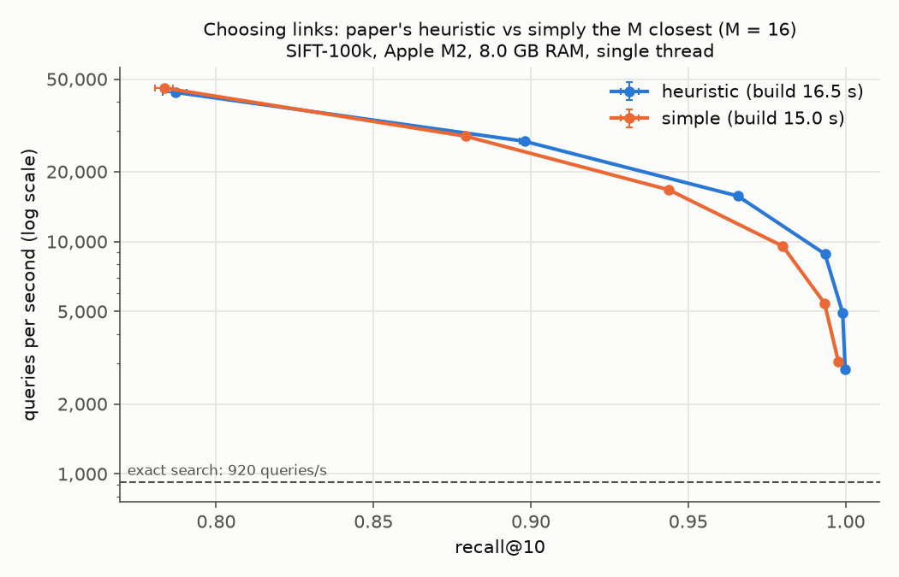
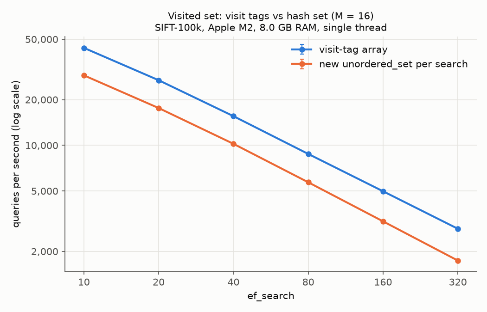
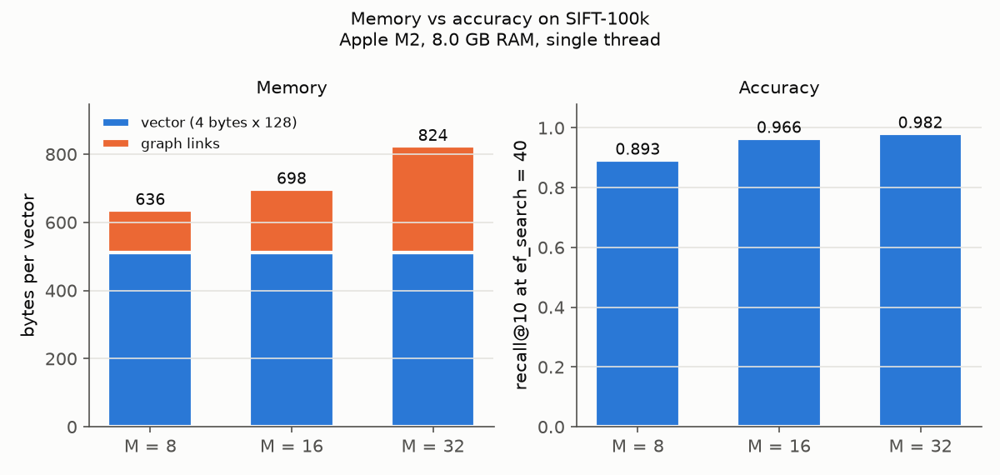
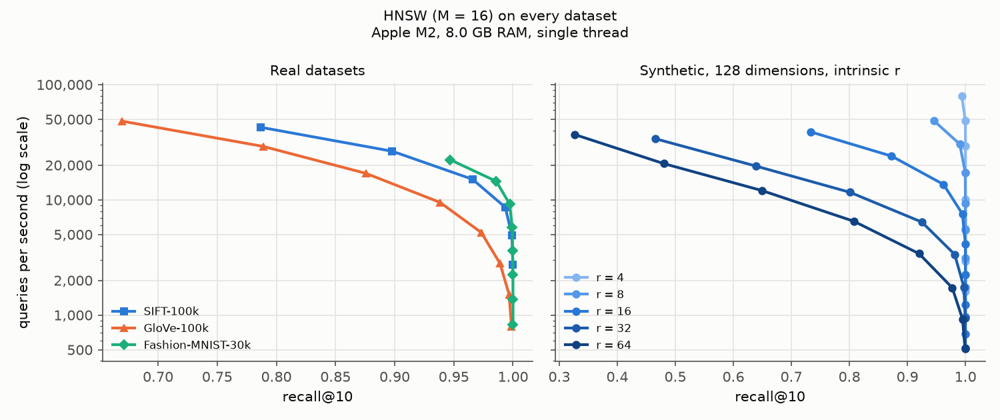

# Benchmarks

All numbers on this page were measured; the raw results are the CSV files in
[`results/`](../results/). Each CSV starts with the exact command, date, commit, CPU, RAM, OS,
compiler and compiler flags it was measured with. To reproduce:

```bash
make datasets   # download and convert the datasets (once)
make bench      # about 20 minutes on an Apple M2
make plots      # redraw the charts in docs/figures/
```

## Method

- **Datasets.** The SIFT experiments below use SIFT-100k; the intrinsic-dimension section also
  uses GloVe-100k, Fashion-MNIST-30k and synthetic data (see the
  [README](../README.md#datasets) for where each comes from).
- **SIFT-100k.** A random sample (seed 42) of 100,000 base vectors and 1,000 queries of SIFT1M
  ([TEXMEX corpus](http://corpus-texmex.irisa.fr/)): 128 dimensions, L2 distance. The true
  nearest neighbours of each query were found by brute force when the dataset was converted.
- **recall@10:** the share of each query's true 10 nearest neighbours that the search returns,
  averaged over the 1,000 queries.
- **Queries per second:** one thread, one query at a time. Each setting first runs all queries
  once to warm up, then 5 timed passes; the pass with the median time is reported, so one pass
  slowed down by something else on the laptop does not skew the result. On macOS the benchmark
  asks for the highest thread priority, so it runs on a performance core rather than an
  efficiency core.
- **Latency:** mean and 99th percentile per query, from the same pass.
- **Memory:** `Index::memory_bytes()`, the bytes allocated for the vectors and the graph, worked
  out from the containers' capacities. It does not count the memory allocator's own overhead.
- **Runs:** every setting is measured 3 times, with seeds 42, 43 and 44, so each run builds a
  different random graph. Charts show the mean, with error bars from the lowest to the highest
  run.
- **HNSW settings:** `M` = 8, 16 or 32, `M_max0 = 2 × M`, `ef_construction = 200`, `k = 10`,
  `ef_search` = 10, 20, 40, 80, 160 and 320.

**Machine:** Apple M2 (8 cores: 4 performance, 4 efficiency), 8 GB RAM, macOS 26.6.2,
Apple clang 21.0.0, `-O3 -march=native -fopenmp-simd`.

## Recall vs speed


HNSW with `M = 16` (mean of 3 runs; speed-up compared with exact search measured in the same
session, 907 queries/s):

| ef_search | recall@10 | queries/s | speed-up vs exact | mean latency | p99 latency |
| ---: | ---: | ---: | ---: | ---: | ---: |
| 10 | 0.787 | 42,575 | 46.9× | 0.024 ms | 0.041 ms |
| 20 | 0.898 | 26,406 | 29.1× | 0.038 ms | 0.056 ms |
| 40 | 0.966 | 15,086 | 16.6× | 0.066 ms | 0.093 ms |
| 80 | 0.993 | 8,616 | 9.5× | 0.116 ms | 0.160 ms |
| 160 | 0.999 | 4,923 | 5.4× | 0.203 ms | 0.275 ms |
| 320 | 1.000 | 2,750 | 3.0× | 0.364 ms | 0.508 ms |

Exact search: 907 queries/s, 1.10 ms per query.

- The spec's target, recall@10 ≥ 0.95, is reached at `ef_search = 40`, **16.6× faster** than
  exact search.
- Each doubling of `ef_search` cuts the speed by about 40%, and the recall gains shrink as
  recall approaches 1.
- A bigger `M` gives better recall at the same `ef_search`, but each step of the search checks
  more links. For the same recall, M = 16 and M = 32 are about equally fast (within 3% at recall
  0.95 and 0.99); M = 8 is about 20% slower at recall 0.9 and 37% slower at 0.99.

## Choosing links: heuristic vs simple



With `M = 16`, comparing the paper's heuristic (Algorithm 4) with simply keeping the M closest
candidates (Algorithm 3):

| ef_search | heuristic recall@10 | simple recall@10 |
| ---: | ---: | ---: |
| 40 | 0.966 | 0.944 |
| 80 | 0.993 | 0.980 |
| 320 | 1.000 | 0.998 |

| target recall@10 | heuristic queries/s | simple queries/s | heuristic faster by |
| ---: | ---: | ---: | ---: |
| 0.95 | 17,816 | 15,185 | 1.17× |
| 0.99 | 9,495 | 6,252 | 1.52× |
| 0.995 | 7,536 | 4,355 | 1.73× |

Build time: 16.5 s with the heuristic, 15.0 s without (mean of 3 runs).

- The heuristic finds more of the true neighbours at the same `ef_search`, and for the same
  recall it is faster; the gap grows as the target recall rises.
- The paper's explanation: the simple method links each node to its closest neighbours, which
  on clustered data tend to sit in the same cluster, so links between clusters get trimmed away
  and searches take detours. The heuristic keeps links that point in different directions.
- The heuristic costs about 1.5 s more to build, for the extra distance computations between
  candidates.
- On the earlier, unrepresentative SIFT subset (the first 100,000 rows, which keep similar
  vectors together; see [below](#lessons-on-measuring-intrinsic-dimension)), the simple method
  was far worse: its recall levelled off around 0.96 and varied from 0.89 to 0.998 between
  seeds. On the random sample the runs agree to within 0.001. Strongly clustered data is where
  the heuristic matters most.

## Visited set: visit tags vs hash set



Same index (`M = 16`), only the way a search remembers visited nodes changes. Visit tags are
**1.5 to 1.6 times faster** at every `ef_search` (43,887 vs 28,930 queries/s at `ef_search = 10`;
2,820 vs 1,740 at 320).

A `std::unordered_set` allocates memory for every node it stores, computes a hash, and spreads
its entries across memory. The visit-tag array is one array lookup and one write per node, with
no allocation and no clearing between searches (see [hnsw.md](hnsw.md#visit-tags-instead-of-a-hash-set)).
Both versions return exactly the same results; a test checks this.

## Memory vs M



| M | bytes per vector | of which graph | index size (100k vectors) | recall@10 at ef_search = 40 |
| ---: | ---: | ---: | ---: | ---: |
| 8 | 636 | 124 | 63.6 MB | 0.893 |
| 16 | 697 | 185 | 69.8 MB | 0.966 |
| 32 | 824 | 312 | 82.5 MB | 0.982 |

- The vectors themselves take 512 bytes each (128 × 4 bytes), so the graph adds 24% (M = 8) to
  61% (M = 32) on top.
- Layer 0 holds up to `2 × M` links of 4 bytes each, plus one spare slot, plus a 24-byte
  `std::vector` header per list. The headers and the allocator's bookkeeping are why flattening
  layer 0 into one array (an optional extra) would save memory.
- The largest index here (82.5 MB) is well under the spec's 200 MB limit. The whole benchmark
  process peaked at 129 MB resident memory for M = 16, including the loaded dataset (measured
  once with `/usr/bin/time -l` at commit 3411832).

## Save and load

Each SIFT-100k index saved to a `.vkt` file, loaded back, and checked: the loaded index returned
exactly the same results for all 1,000 queries. One run each (no repeats), at commit 3411832,
measured with:

```bash
build/vektor-bench run --data data/sift-100k.vkd --M 8,16,32 --ef-search 40 --save /tmp/sift.vkt
```

| M | file size | in memory | save | load |
| ---: | ---: | ---: | ---: | ---: |
| 8 | 56.6 MB | 63.6 MB | 0.20 s | 0.16 s |
| 16 | 59.9 MB | 69.8 MB | 0.21 s | 0.19 s |
| 32 | 62.7 MB | 82.5 MB | 0.22 s | 0.21 s |

The file is 11% (M = 8) to 24% (M = 32) smaller than the index in memory. The file stores only
the links that exist; in memory, each link list also keeps room for `M_max0 + 1` links (or
`M + 1` on upper layers) and a 24-byte `std::vector` header. The time includes computing the
CRC-32 checksum, one byte at a time.

## Intrinsic dimension

This experiment re-tests the intrinsic-dimension findings of my earlier paper,
[*Empirical Study of Approximate Nearest Neighbour Methods Across Data Regimes*](https://github.com/anibitri/ANN_methods)
(which benchmarked hnswlib, FAISS and ScaNN), on Vektor's own HNSW. The paper's claims that
Vektor can test:

1. Intrinsic dimension predicts ANN performance better than nominal dimension (the number of
   coordinates).
2. With nominal dimension fixed at 128, HNSW's speed at recall 0.95 drops about tenfold from
   low to high intrinsic dimension (synthetic data, ID 5 vs ID 30, 500,000 points).
3. The paper's TwoNN estimates, from a 5,000-point sample: SIFT1M 19.4, synthetic ID 5 about
   5.4, synthetic ID 30 about 21.7.



**Estimating intrinsic dimension** (`vektor-bench twonn`), two ways:

- **As in the paper:** 5,000 random points, with each point's neighbours searched only among
  those 5,000 (as `scikit-dimension` does). With so few points the neighbours are far apart, so
  this measures the data at a coarse scale. Both TwoNN (Facco et al., 2017: the ratio of the
  distances to the 2nd and 1st nearest neighbours) and the Levina-Bickel MLE (2004, 20
  neighbours) are computed on that sample.
- **At the finest scale:** 2,000 random points, with neighbours searched among all the vectors.

**Measuring speed:** queries per second at a fixed recall@10 (0.9, 0.95 and 0.99), read off each
dataset's recall-vs-speed curve (`M = 16`, mean of 3 runs), between the two `ef_search` settings
around the target. Where even the smallest useful `ef_search` (10, the same as k) beats the
target, the true speed is higher, so the value is a lower bound (≥ below, hollow in the chart).

| dataset | dim | TwoNN, as in the paper | MLE, same sample | TwoNN, finest scale | queries/s at recall 0.9 | at 0.95 | at 0.99 |
| --- | ---: | ---: | ---: | ---: | ---: | ---: | ---: |
| SIFT-100k | 128 | 19.3 | 18.6 | 15.0 | 25,966 | 17,184 | 9,242 |
| GloVe-100k | 100 | 27.1 | 29.8 | 23.4 | 13,550 | 7,767 | 2,591 |
| Fashion-MNIST-30k | 784 | 14.4 | 14.3 | 15.6 | ≥ 22,258 | 21,526 | 12,275 |
| synthetic, r = 4 | 128 | 4.0 | 4.3 | 4.2 | ≥ 79,304 | ≥ 79,304 | ≥ 79,304 |
| synthetic, r = 8 | 128 | 8.0 | 8.1 | 8.3 | ≥ 48,770 | 46,405 | 30,488 |
| synthetic, r = 16 | 128 | 14.1 | 14.0 | 15.3 | 20,164 | 14,699 | 8,217 |
| synthetic, r = 32 | 128 | 23.0 | 21.9 | 25.3 | 7,226 | 4,810 | 2,363 |
| synthetic, r = 64 | 128 | 32.7 | 30.6 | 37.0 | 3,830 | 2,388 | 1,100 |


### Comparison with the paper

| | paper | Vektor |
| --- | --- | --- |
| TwoNN of SIFT (5,000-point sample) | 19.4 (SIFT1M) | 19.3 (SIFT-100k, a random sample of SIFT1M) |
| TwoNN of low-ID synthetic data | 5.3 to 5.4 (ID 5) | 4.0 (r = 4), 8.0 (r = 8) |
| TwoNN of high-ID synthetic data | 21.4 to 21.9 (ID 30) | 23.0 (r = 32) |
| HNSW speed drop at recall 0.95, low to high ID | about 10× (ID 5 to 30, 500,000 points) | 9.6× (r = 8 to 32), at least 16× (r = 4 to 32), 100,000 points |
| Nominal dimension a weaker predictor than intrinsic | yes | yes |

- **The intrinsic-dimension estimates reproduce.** On the same data with the same method,
  Vektor's TwoNN for SIFT is 19.3 against the paper's 19.4. (A separate numpy check on all of
  SIFT1M gave 19.40.) Both find the low-ID synthetic data close to its true dimension and
  underestimate high ID by a similar amount (23 for r = 32; 21.7 for ID 30).
- **The tenfold slowdown reproduces.** With nominal dimension fixed at 128, Vektor's HNSW needs
  9.6 times longer per query at recall 0.95 for r = 32 than for r = 8, and at least 16 times
  longer than for r = 4; the paper reports about 10 times from ID 5 to ID 30. The datasets
  differ in size (100,000 vs 500,000 points) and shape (one Gaussian vs ten clusters), so close
  agreement in the exact factor is not expected.
- **Nominal dimension does not predict difficulty.** Fashion-MNIST has 784 coordinates, six
  times more than SIFT, yet it is the fastest real dataset at recall 0.95 and 0.99, and it has
  the lowest intrinsic dimension of the three (about 14). Among the real datasets, speed at
  recall 0.99 follows intrinsic dimension: Fashion-MNIST (14) fastest, then SIFT (19), then
  GloVe (27).
- **Real data is easier than synthetic data of the same intrinsic dimension.** All three real
  datasets lie above the synthetic curve (SIFT about twice as fast at recall 0.99 as synthetic
  data of dimension 19). Synthetic data here is a single Gaussian with no cluster structure;
  real data has clusters that the graph can exploit. So intrinsic dimension explains most, but
  not all, of the difference between datasets.
- **Absolute speeds are not compared.** The paper measured hnswlib through Python on other
  hardware, so only the ratios above are compared.
- **The GloVe datasets differ.** The paper used ann-benchmarks' GloVe-100 (Twitter, 1.18
  million words; TwoNN 38.5); Vektor uses gensim's Wikipedia + Gigaword GloVe (TwoNN 27.1), so
  those two values are not comparable.

### Lessons on measuring intrinsic dimension

- **Scale matters.** TwoNN estimates the dimension at the scale of the nearest neighbours, and
  that scale depends on how many points the neighbours are searched among. For the synthetic
  data both ways agree; for real data they can differ (GloVe 27.1 vs 23.4).
- **Don't take the first rows of SIFT1M.** Vektor first built SIFT-100k from the first 100,000
  base vectors, assuming the file was in random order. It is not: 51% of those points have their
  nearest neighbour within 1,000 rows of themselves (random order would give about 2%), probably
  because descriptors from the same image are stored together. That subset's TwoNN, as in the
  paper, was 15.7 instead of 19.4, and at the finest scale only 3.4. SIFT-100k is now a random
  sample (seed 42), which gives 19.3.

Limitations of this experiment: one HNSW setting (`M = 16`); 5,000 points per estimate; the
datasets differ in size (Fashion-MNIST has 30,000 vectors, the others 100,000) and metric (GloVe
uses cosine); several speeds at recall 0.9 are only lower bounds; and only HNSW is tested, not
the paper's IVF, IVF-PQ and ScaNN results.

## Limitations

- One laptop, one thread. Laptop timings depend on background load and temperature; the median
  of 5 passes and the run-to-run error bars show how much they moved.
- Memory is estimated from container capacities, not measured from the operating system.
- Recall compares row numbers. SIFT values are whole numbers, so two vectors can be exactly the
  same distance from a query; if they tie for 10th place, returning the "other" one counts as a
  miss.
- No comparison with hnswlib yet.
